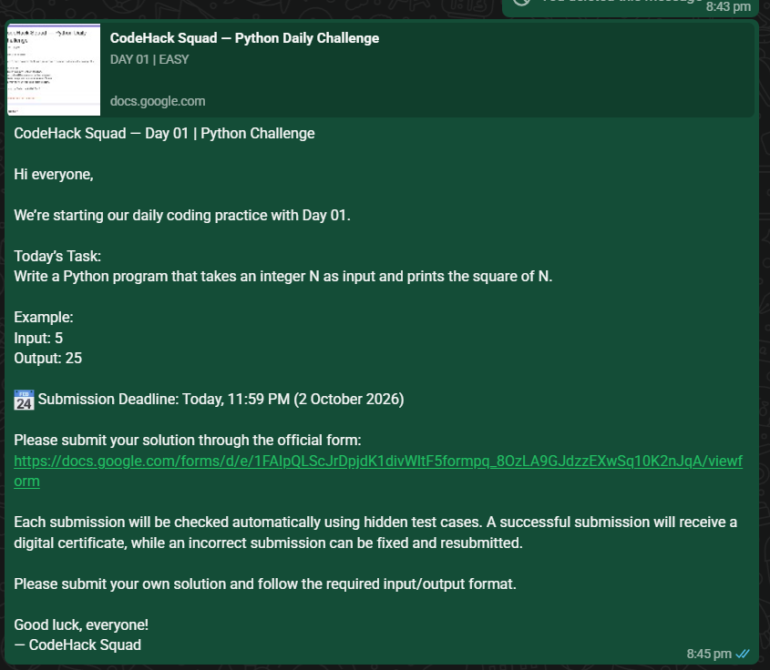
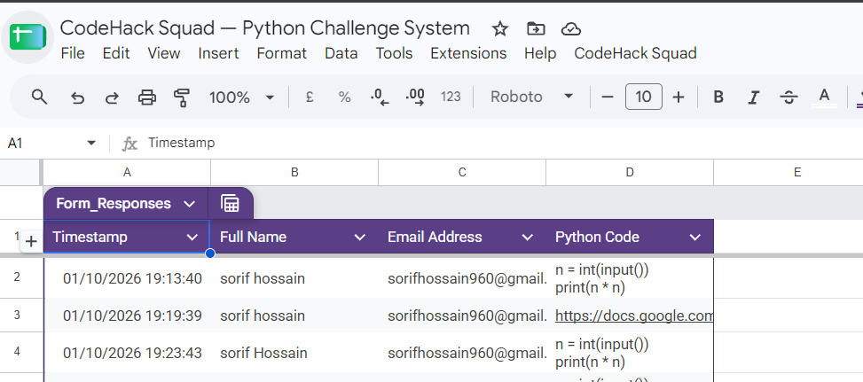
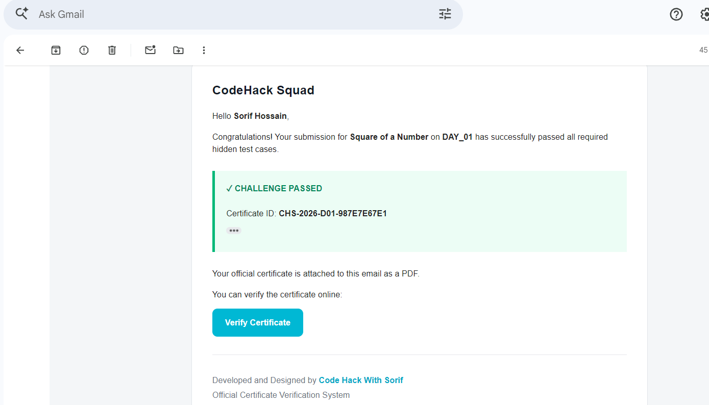
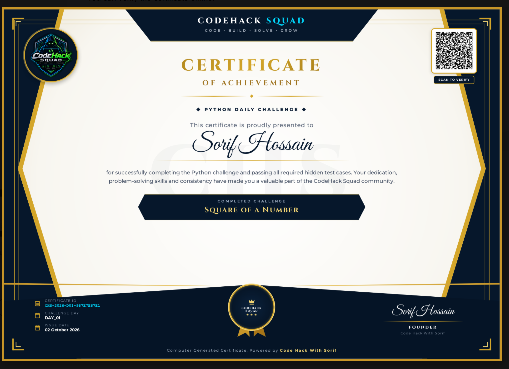
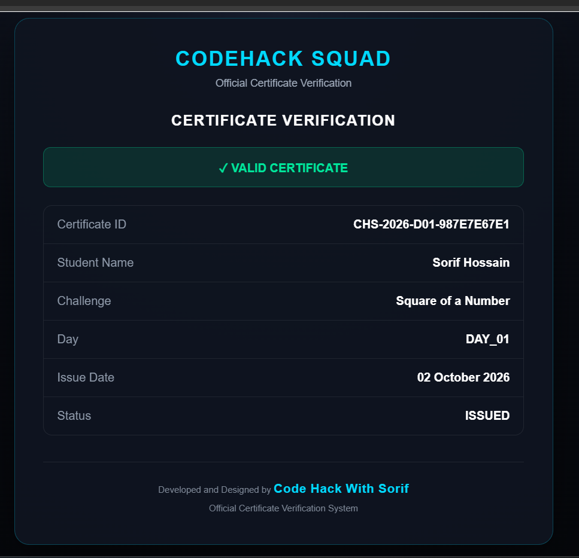

# 🚀 CodeHack Squad — Serverless Python Daily Challenge Automation System


An end-to-end, serverless automation system built for the **CodeHack Squad** community to run daily Python programming challenges with automated evaluation, attempt tracking, certificate generation, email delivery, and QR-based online verification.

The system is implemented with **Google Apps Script** and Google Workspace services, with **Judge0 CE** used as the remote Python execution engine.

## 🚀 Try the Live System

Want to see the automation in action? Submit your own Python solution through the live Google Form and test the complete challenge → evaluation → result workflow.

👉 **[Open the Live Python Challenge Form](https://docs.google.com/forms/d/e/1FAIpQLScJrDpjdK1divWltF5formpq_8OzLA9GJdzzEXwSq10K2nJqA/viewform)**

---

## 🌟 Project Overview

**CodeHack Squad** is a student technology community focused on collaborative learning, project building, problem solving, and continuous technical development.

The Python Daily Challenge system was created to turn the daily coding workflow into an automated pipeline:

**Challenge → Submission → Hidden Tests → Result → Certificate → Email → Verification**

Instead of manually checking every submission, the automation receives a student's Python solution through a permanent Google Form, evaluates it against predefined hidden test cases, records the result in Google Sheets, and processes a certificate automatically when all tests pass.

The system was designed for a real community workflow.

---

## 👨‍💻 My Role

**Sorif Hossain**  
**Tech Representative & Lead @ CodeHack Squad**  
**Founder — Code Hack With Sorif**

I architected and developed the automation system to reduce repetitive manual work involved in challenge evaluation, result management, certificate generation, and verification.

The implementation focuses on:

- event-driven automation
- reusable daily challenge management
- automated hidden-test evaluation
- structured spreadsheet-based data storage
- certificate lifecycle management
- operational recovery utilities
- QR-based certificate verification

---

# ⚙️ System Architecture

```text
                    CODEHACK SQUAD
                          │
                          ▼
             ┌─────────────────────────┐
             │ Permanent Google Form   │
             │ Full Name               │
             │ Email Address           │
             │ Python Code             │
             └────────────┬────────────┘
                          │
                          ▼
              ┌────────────────────────┐
              │ Google Apps Script     │
              │ onFormSubmit Trigger   │
              └────────────┬───────────┘
                           │
                           ▼
                ┌──────────────────────┐
                │ Active Challenge     │
                │ + Hidden Test Cases  │
                └──────────┬───────────┘
                           │
                           ▼
                ┌──────────────────────┐
                │ Judge0 CE API        │
                │ Python Execution     │
                └──────────┬───────────┘
                           │
                 ┌─────────┴─────────┐
                 │                   │
               FAIL                 PASS
                 │                   │
                 ▼                   ▼
        Failure Email        Duplicate Check
        + Attempt Log              │
                                   ▼
                         Certificate Generation
                                   │
                         ┌─────────┼─────────┐
                         ▼         ▼         ▼
                      HTML/CSS     QR      PDF
                         │                   │
                         └────────┬──────────┘
                                  ▼
                         Google Drive Archive
                                  │
                                  ▼
                          Certificate Record
                                  │
                                  ▼
                           MailApp Email
                           + PDF Attachment
                                  │
                                  ▼
                       QR Verification Web App
                                  │
                                  ▼
                         CERTIFICATES Sheet
```

---

# 🔄 End-to-End Workflow

### 1. Challenge Management

A daily challenge is stored in the `CHALLENGES` sheet with:

- Day
- Challenge title
- Problem statement
- Difficulty
- Hidden test cases
- Active/Inactive status

The `publishChallenge()` workflow can create or update a challenge and activate it. Activating a day also updates the permanent Google Form with the current challenge.

### 2. Submission Intake

Students submit:

- Full Name
- Email Address
- Python Code

through a single permanent Google Form.

The form is connected to the Google Spreadsheet and the installed spreadsheet `onFormSubmit` trigger invokes `handleSubmission()`.

### 3. Automated Python Evaluation

The submitted Python code is sent to **Judge0 CE** for execution.

For every hidden test case, the system provides the configured input to Judge0 and captures:

- execution status
- standard output
- standard error
- compilation output
- execution result

Output correctness is then evaluated by the local `outputsMatch_()` matcher.

The matcher supports exact output as well as controlled variations such as:

```text
25
square = 25
Result: 25
```

For text-based challenges, the matcher also supports output labels while rejecting contradictory phrases such as:

```text
The answer is not Positive
```

A submission is marked `PASS` only when **all configured hidden tests pass**.

### 4. Submission & Student Tracking

Every attempt is recorded in:

- `SUBMISSIONS`
- the relevant `DAY_XX` sheet
- `STUDENTS`

The system tracks attempt number, test counts, result, active day, and certificate status.

Concurrent submission handling uses `LockService` around critical submission recording and certificate issuance operations to reduce duplicate attempt/certificate race conditions.

### 5. Failure Handling

When a submission fails:

- the attempt is recorded as `FAIL`
- no certificate is issued for that failed attempt
- a failure email is sent
- the student can correct the solution and submit again

The system also distinguishes temporary evaluation failures from normal wrong answers so an infrastructure problem is not treated as a student coding failure.

### 6. Certificate Issuance

A successful submission first goes through duplicate-certificate protection.

For an eligible successful submission, the system:

1. generates a unique certificate ID
2. creates the verification URL
3. generates a QR code using QuickChart
4. loads the official CodeHack Squad logo from Drive
5. builds the certificate using HTML/CSS
6. converts the generated HTML into a PDF
7. stores the PDF in Google Drive
8. saves certificate metadata in `CERTIFICATES`
9. updates the student's certificate count
10. sends the certificate through email as a PDF attachment

Certificate IDs follow the pattern:

```text
CHS-YYYY-DXX-RANDOM
```

Example format:

```text
CHS-2026-D03-XXXXXXXXXX
```

### 7. Certificate Email Delivery

The system uses the Google Apps Script **MailApp** service to send personalized HTML emails.

Successful emails include:

- student name
- challenge name
- challenge day
- certificate ID
- online verification link
- PDF certificate attachment

Email status is persisted in the `CERTIFICATES` sheet.

### 8. QR-Based Verification

Every certificate contains a QR code pointing to the deployed Apps Script Web App.

The verification endpoint accepts a certificate ID and looks it up in the `CERTIFICATES` sheet.

The portal supports:

- valid certificate verification
- invalid certificate handling
- revoked certificate handling
- certificate detail display

The verification page is branded with:

**Developed and Designed by Code Hack With Sorif**

---

# 🗃️ Spreadsheet Database Architecture

The Google Spreadsheet acts as the lightweight application database.

| Sheet          | Purpose                                                    |
| -------------- | ---------------------------------------------------------- |
| `CONFIG`       | Runtime configuration and system settings                  |
| `CHALLENGES`   | Daily challenges, difficulty, test cases and active status |
| `STUDENTS`     | Student identity and progress tracking                     |
| `SUBMISSIONS`  | Every submitted attempt and evaluation result              |
| `CERTIFICATES` | Certificate lifecycle, verification and email records      |
| `DAY_XX`       | Day-specific submission and result view                    |

### `CONFIG`

Stores runtime values such as:

- Judge0 URL
- Python language ID
- Judge0 enable/disable status
- Judge0 API key, when applicable
- Verification Web App URL
- Form ID / Form URL
- Certificate folder ID
- Admin email
- Active day
- trigger status

**Live configuration values should not be committed to a public repository.**

### `STUDENTS`

Tracks:

- Student ID
- Name
- Email
- First submission
- Last submission
- Total attempts
- Total passes
- Total fails
- Certificates issued
- Last active day
- Updated timestamp

### `SUBMISSIONS`

Tracks:

- Timestamp
- Attempt ID
- Student
- Email
- Day
- Attempt number
- Tests passed
- Total tests
- Result
- Certificate status
- Submitted code

### `CERTIFICATES`

Tracks:

- Issue date
- Certificate ID
- Student
- Email
- Day
- Challenge
- Attempt ID
- Status
- Verification URL
- PDF file ID
- PDF file URL
- Email status

---

# 🧪 Judge0 Evaluation Engine

The evaluation pipeline is deliberately split into two responsibilities:

```text
Judge0
   │
   ├── Execute Python
   ├── Return status
   ├── Return stdout/stderr
   └── Return compilation information
                │
                ▼
Google Apps Script
                │
                └── Compare actual output
                    against expected output
```

This separation allows the system to accept valid coding approaches that may differ in syntax while still evaluating the required result.

The configured Python runtime in the current implementation is **Judge0 language ID 71**.

The execution request is constrained with:

- CPU time limit
- wall time limit
- memory limit

The system also polls submissions that remain in queued/processing states before final evaluation.

---

# 🛡️ Reliability & Operational Safeguards

The current implementation includes several reliability-oriented mechanisms:

### Duplicate Certificate Protection

A student should receive only one issued certificate per challenge day.

Before issuing a certificate, the system checks existing certificate records and uses a script lock around the issuance path.

### Email Recovery

If a certificate already exists but email delivery previously failed, the system can resend the existing archived PDF instead of generating another certificate.

### Certificate Revocation

Administrators can mark a certificate as:

```text
REVOKED
```

The verification portal then reports the certificate as revoked.

### Status Synchronization

Historical certificate records can be synchronized back into day-specific sheets when a previous automation run left certificate status fields out of sync.

### Historical Recovery

Administrative utilities support rechecking previous submissions and reissuing/recovering certificate records when required.

---

# 🧰 Admin & Testing Utilities

The Apps Script project exposes an admin menu with operations such as:

- Setup / Repair System
- Repair Submission Trigger
- Show Permanent Form URL
- Test Judge0 Connection
- Test Hidden Judge
- Test Full Certificate Pipeline

Additional functions support authorization checks, certificate resend/recovery, certificate synchronization, certificate reissue workflows, and certificate revocation.

---

# 🛠️ Technology Stack

### Core Automation

**Google Apps Script (JavaScript)**

### Data & Workflow

**Google Sheets**  
**Google Forms**  
**Google Drive**

### Code Execution

**Judge0 CE API**

### Certificate & Web Interface

**HTML5**  
**CSS3**  
**Google Apps Script Web App**

### Email

**Google Apps Script MailApp**

### QR Generation

**QuickChart QR API**

### PDF Generation

Google Apps Script HTML Blob conversion to PDF using:

```javascript
htmlBlob.getAs(MimeType.PDF);
```

---

# 📁 Repository Structure

A clean public repository layout is recommended:

```text
.
├── appscript/
│   └── google.gs
│
├── screenshots/
│   ├── challenge-announcement.png
│   ├── backend-database.png
│   ├── automated-email.png
│   ├── generated-certificate.png
│   └── verification-portal.png
│
├── README.md
└── LICENSE
```

Use clean, space-free screenshot filenames in the repository so GitHub image references remain predictable and easy to maintain.

---

# 🚀 Setup & Deployment

## Prerequisites

Before deploying the system, prepare:

1. A Google Account
2. A Google Spreadsheet
3. A Google Apps Script project bound to that spreadsheet
4. Access to Judge0 CE or another compatible Judge0 endpoint
5. A Google Drive folder containing the official CodeHack Squad logo
6. A deployed Apps Script Web App for certificate verification

---

## 1. Create the Spreadsheet

Create a new Google Spreadsheet.

Open:

```text
Extensions → Apps Script
```

Then add the project source file:

```text
appscript/google.gs
```

---

## 2. Configure Public-Safe Placeholders

The public repository intentionally contains placeholders such as:

```text
[YOUR_SQUAD_LOGO_FOLDER_ID]
[YOUR_WEB_APP_URL_HERE]
[YOUR_TEST_EMAIL_HERE]
```

These must be replaced in your private deployed copy.

Do **not** commit:

- Judge0 API keys
- private Google Drive IDs when not intended for public disclosure
- private spreadsheet IDs
- private form IDs
- internal admin email addresses
- live deployment-specific configuration

---

## 3. Run Initial Setup

From the Apps Script editor, run:

```javascript
setupSystem();
```

The setup process creates/repairs the core spreadsheet architecture and prepares the permanent form, submission trigger, and certificate archive.

---

## 4. Deploy the Verification Web App

Deploy the Apps Script project as a Web App.

Then copy the generated Web App URL into the private project's configuration:

```text
CONFIG → VERIFICATION_URL
```

The certificate system uses this URL when generating verification links and QR codes.

---

## 5. Configure the Judge0 Endpoint

The default Judge0 endpoint is:

```text
https://ce.judge0.com
```

The current configuration uses:

```text
PYTHON_LANGUAGE_ID = 71
JUDGE0_ENABLED = YES
```

When a Judge0 API key is required by the selected deployment, store it in the private `CONFIG` sheet rather than in the Git repository.

---

## 6. Configure the Logo Folder

Provide the private Drive folder ID containing the official CodeHack Squad logo.

The script searches the folder for an image and prefers filenames containing:

```text
logo
```

If an external logo is unavailable, the certificate generator has a built-in fallback SVG mark.

---

## 7. Authorize the System

Run:

```javascript
authorizeSystem();
```

This checks the configured external Judge0 endpoint and initializes access checks for email and Drive operations.

---

## 8. Test the Pipeline

Recommended test sequence:

```javascript
testPythonExecution();
testFlexibleOutput();
testHiddenJudge();
testFullCertificatePipeline();
```

Use your own test email in the private deployment before running the full certificate test.

---

# 🔐 Security & Privacy Notes

This repository is designed to be **public-source friendly**, but the deployed automation should still be treated as a privileged Google Workspace application.

### Secrets

Credentials and live environment values belong in the private `CONFIG` sheet and should not be hardcoded into the public source.

### Arbitrary Code Execution

Student-submitted Python is executed through Judge0. The system therefore depends on the execution environment and its isolation controls.

This project does **not** claim to be:

- unhackable
- 100% secure
- abuse-proof
- a complete sandbox security boundary

Additional production hardening may be appropriate for larger public deployments, including:

- submission rate limiting
- abuse controls
- stronger input validation
- monitoring and alerting
- quota management
- tighter access policies

### Data Privacy

The system stores student names, email addresses, source code, attempt records, and certificate metadata in Google Workspace services. Deployment owners should configure sharing and access permissions appropriately.

---

# 📸 System Showcase

## 1. Challenge Announcement

Daily challenges are published with clear problem statements, difficulty and submission instructions.



## 2. Backend Database

Google Sheets acts as the operational data layer for challenges, students, submissions and certificates.



## 3. Automated Email Notification

Successful submissions trigger a personalized email containing the certificate verification link and PDF attachment.



## 4. Generated Certificate

Certificates are generated dynamically from HTML/CSS and archived as PDF files.



## 5. Certificate Verification Portal

Each certificate contains a QR code that opens the verification Web App.



---

# 📈 Design Goals

The system was designed around a simple operating model:

> **Build once → publish the daily challenge → let the automation handle the repetitive workflow.**

Daily operations mainly consist of creating/updating the challenge and activating the appropriate day. The permanent form, trigger, judging flow, tracking, certificate pipeline, and verification system remain reusable across challenge days.

---

# 🚧 Current Limitations

The current implementation is optimized for a student community workflow using Google Workspace and Judge0.

Known operational considerations include:

- Google Apps Script quotas and execution limits
- Google Workspace service limits
- Judge0 availability and API limits
- external QR generation dependency
- public form abuse/rate-limit considerations
- spreadsheet scalability for very large submission volumes

For substantially larger deployments, a dedicated backend/database and stronger abuse-control layer would be appropriate.

---

# 🔮 Future Improvements

Possible future development directions:

- dedicated web-based challenge dashboard
- authentication and role-based administration
- per-user rate limiting
- leaderboard and analytics dashboard
- challenge scheduling
- stronger submission abuse protection
- dedicated database backend
- richer verification APIs
- deployment monitoring and health checks

---

# 📜 License

This project is released under the **MIT License**.

See [`LICENSE`](LICENSE) for details.

---

# 👤 Author

**Sorif Hossain**

**Tech Representative & Lead @ CodeHack Squad**  
**Founder — Code Hack With Sorif**

Built for the **CodeHack Squad Python Daily Challenge** workflow.

### Connect

[](https://www.linkedin.com/in/sorif-hossain-code-hack/)
[](https://www.youtube.com/@CodeHackWithSorif)
[](https://whatsapp.com/channel/0029VbBJa7iIt5rtVuNzfP2g)
[](https://www.instagram.com/codehackwithsorif/)
[](https://www.facebook.com/people/Sorif-Hossain/61590723238904/)

> **Developed and Designed by Code Hack With Sorif**
